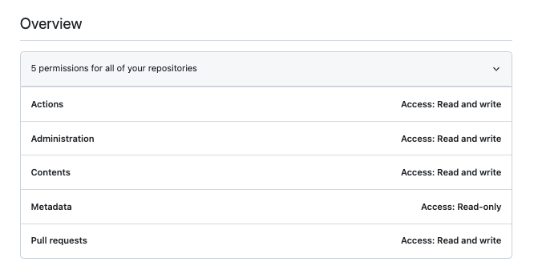

# Stonesoup installation

* [Pre-requisite](#pre-requisite)
* [Quicklab](#quicklab)
  * [Cluster setup](#cluster-setup)
  * [Deploy the backend](#deploy-the-backend)
  * [Install the frontend](#install-the-frontend)
  * [Post installation](#post-installation)
  * [Proxy url](#proxy-url)
* [Demo](#demo)
  * [Prerequisite](#prerequisite)
  * [Samples](#samples)
  * [Automate tests](#automate-tests)
  * [Setup a new pipeline](#setup-a-new-pipeline)
* [Issue](#issue)
* [QuickLab URL and credentials](#quicklab-url-and-credentials)
  * [upi-0.mystone.lab.upshift.rdu2.redhat.com](#upi-0mystonelabupshiftrdu2redhatcom)
  * [upi-0.snowdrop.lab.psi.pnq2.redhat.com](#upi-0snowdroplabpsipnq2redhatcom)
* [CRC](#crc)
  * [Instructions](#instructions)
* [Tips](#tips)


## Pre-requisite

- [Konfig](https://github.com/corneliusweig/konfig) tool able to merge/manage different kube context
- [Kubectx and kubens](https://github.com/ahmetb/kubectx) to switch between the context or namespace

## Quicklab

### Cluster setup

In order to play with Stonesoup, we need an ocp4 cluster with 3 nodes and 3 workers. It can be created
using the application: `https://quicklab.upshift.redhat.com/`.

Select as template: `openshift4upi` and this region `osp_lab-ci-rdu2-a` to create the VMs.
When the VMs are ready, then install the cluster using the button `New bundle` and `openshift4upi`.

**Note**: Select the region `osp_lab-ci-rdu2-a` as it offers more cpu/memory than asian region

To ssh to the VM, copy locally the `quicklab.key`
```bash
wget https://gitlab.cee.redhat.com/cee_ops/quicklab/raw/master/docs/quicklab.key -P config && chmod 600 quicklab.key

QUICK_LAB_HOST=<QUICK_LAB_HOSTNAME>
ssh -i config/quicklab.key -o "UserKnownHostsFile /dev/null" -o "StrictHostKeyChecking no" -o "IdentitiesOnly yes" quicklab@$QUICK_LAB_HOST
```

Next, retrieve the kubeconfig file and merge it locally within your `.kube/config` file

```bash
QUICK_LAB_HOST=<QUICK_LAB_HOSTNAME>
./qlssh.sh $QUICK_LAB_HOST "cat /home/quicklab/oc4/auth/kubeconfig" > config/$QUICK_LAB_HOST.cfg
```

Edit the `config/$QUICK_LAB_HOST.cfg` file to rename the context from `admin` to your quicklab host by example (e.g mystone)
```text
contexts:
- context:
    cluster: mystone
    user: admin
  name: mystone
current-context: mystone
```

Import the context and switch to use it
```bash
konfig import --save config/$QUICK_LAB_HOST.cfg
kubectx mystone
```

### Deploy the backend

Before to execute the command described hereafter, it is first needed to fork this git repository: `https://github.com/redhat-appstudio/infra-deployments/`
within your `GIT_HUB_ORG`. This forked project will be used by argocd to sync the resources to be installed and the installation script will create/commit a branch top of it !

Git clone locally either the forked project (if you plan to develop) or the parent project: `git clone https://github.com/redhat-appstudio/infra-deployments.git`

Create the NFS Storage Class on ocp4 by executing the following script. This storage class will be used to create the Persistent volumes from PVC requests
automatically:
```bash
cd infra-deployments(-fork)
./hack/quicklab/setup-nfs-quicklab.sh $QUICK_LAB_HOST
```

We can now configure the `preview.env` file (`cp hack/preview-template.env hack/preview.env`) which contains different 
variables needed to by example download images from docker hub, push the build images to a registry,
setup the github org hosting the forked project containing the argocd resources, etc.

The most important keys to configure are:
```text
export MY_GIT_FORK_REMOTE=git@github.com:<GITHUB_ORG>/infra-deployments.git
export MY_GITHUB_TOKEN=<PERSONAL GITHUB TOKEN>

export HAS_DEFAULT_IMAGE_REPOSITORY=quay.io/<QUAY_USER>/<REPOSITORY>
export DOCKER_IO_AUTH=<Format username:access_token>
```

The Github Personal Access Token must have the following rights



Next, deploy the backend part of stonesoup by executing the following bash script
```bash
./hack/bootstrap-cluster.sh --toolchain --keycloak preview
```

Open the ocp & argocd console
```text
open https://console-openshift-console.apps.$QUICK_LAB_DOMAIN
open https://openshift-gitops-server-openshift-gitops.apps.$QUICK_LAB_DOMAIN
```

### Install the frontend

Fork the project https://github.com/jduimovich/standalone-hac.git within a `GIT_HUB_ORG` and clone the project locally
```bash
git clone git@github.com:<GIT_HUB_ORG>/standalone-hac.git standalone-hac-fork
cd standalone-hac-fork
```
Create a branch using as name the <HOST_NAME> where stonesoup is deployed
```bash
git checkout -b $QUICK_LAB_HOST
```
Copy the folder `./hack/no-commit-templates` to `./hack/nocommit`

Download your docker credentials to access the quay registry using this link: https://quay.io/organization/<QUAY_ORG>?tab=robots within the file `./hack/quay-io-auth.json` 

Create now the `./hack/nocommit/my-secret.yml` file using the following kubectl command:
```bash
kubectl create secret docker-registry quay-cloudservices-pull --from-file=.dockerconfigjson=./hack/nocommit/quay-io-auth.json --dry-run=client -o yaml > ./hack/nocommit/my-secret.yml
```

Generate the `FrontendEnvironment` CRD using the script `./hack/update-sso.sh` to configure the dev-sso auth domain, hostname
and commit the change within your branch

**Warning**: Edit manually the generated file `components/hac-boot/environment.yaml` to fix the hostname field and append the VM hostname before the domain !

Git clone the following project `clowder` with the parent folder:
```bash
cd ..
git clone https://github.com/RedHatInsights/clowder.git
```
Git clone the following project `crc-k8s-proxy` with the parent folder:

```bash
git clone https://github.com/jduimovich/crc-k8s-proxy.git
```

Create an `envfile` file from the `./envfile-template-local-cluster` template and set the following 2 parameters `HOSTNAME` and `TOKEN`
```text
KEYCLOAK_URL=http://keycloak-svc.dev-sso.svc:8080/auth/realms/redhat-external
HOSTNAME=computed
PROXYSSL=false
SSL=true
MODE=complex
TOKEN=<OCP_LOGIN_TOKEN>
K8SURL=https://kubernetes.default.svc
```

Customize the `standalone-hac-fork` forked repo to point to your branch and commit the change by running this script `./hack/update-app-revisions`

Replace the hard coded `repoURL` using as git repo `https://github.com/jduimovich/standalone-hac.git` with your forked git repo

Execute now this script to install crowder, crc-k8s-proxy and hac-dev:
```bash
./hack/install.sh
```

URL to be used to register and got the oc login token: https://registration-service-toolchain-host-operator.apps.mystone.lab.upshift.rdu2.redhat.com/
```text
oc login --token=eyJhbGciOiJSUzI1NiIsInR5cCIgOiAiSldUIiwia2lkIiA6ICJDaDRxMkg4U2kya1BJc0F6ZHZCRzRuUW5Kcm5ZWUpVZXB3WHpPRkVIanhvIn0.eyJleHAiOjE2NzY5OTQxMjAsImlhdCI6MTY3Njk4NjkyMCwiYXV0aF90aW1lIjoxNjc2OTg2ODQ3LCJqdGkiOiIzMTc4Y2ZjMS0zYmNkLTRhMTItYmEyYy1jMjEzZGMyMmZiZDkiLCJpc3MiOiJodHRwczovL2tleWNsb2FrLWRldi1zc28uYXBwcy5teXN0b25lLmxhYi51cHNoaWZ0LnJkdTIucmVkaGF0LmNvbS9hdXRoL3JlYWxtcy9yZWRoYXQtZXh0ZXJuYWwiLCJhdWQiOiJjbG91ZC1zZXJ2aWNlcyIsInN1YiI6InVzZXIxIiwidHlwIjoiSUQiLCJhenAiOiJjbG91ZC1zZXJ2aWNlcyIsIm5vbmNlIjoiMDA5MjNlZDEtY2YxNC00ZjZhLTliMGQtMTMzNjI2NTk3ZjIyIiwic2Vzc2lvbl9zdGF0ZSI6IjY5MzM4YzI2LTM5NmMtNGRiNS04MDg0LTliNmJhYWE4ZjYwMiIsImF0X2hhc2giOiJldWJ5OFRsbTNBU252eVpRQ0hJb3hnIiwiYWNyIjoiMCIsInNpZCI6IjY5MzM4YzI2LTM5NmMtNGRiNS04MDg0LTliNmJhYWE4ZjYwMiIsImVtYWlsX3ZlcmlmaWVkIjp0cnVlLCJuYW1lIjoidXNlcjEiLCJwcmVmZXJyZWRfdXNlcm5hbWUiOiJ1c2VyMSIsImdpdmVuX25hbWUiOiJ1c2VyMSIsImVtYWlsIjoidXNlcjFAdXNlci51cyJ9.DrkIjina0o0H2MZw4O2XbnSJnUX2eUwjA9M3g0q3cJFVhSXxJcSYJ6mVory2Qwb04CnIOvcDqdHV3dgmxIUoZ1eugcsWKcO9hX57Gz3i_DgGaCOO5im7Qa7XlkZxDnIMmTzx7oNHbQeuvYgORwVIbR9WdiJwWY4QCuHAlXgPNurotjgwBFECEn2igQwVzlBod89W4IdD2a79FNrPgv8RHfiWrvSjQqglp7ZquC8VEFxG_rAQoFPUc6KHxAZmfQ25I4qHDXIlhAWJ9WKUiS8psJ_7ZVywT8lkJhO1Hh90uhP_S0qv1TzjK16JpuUQcHDoHMBdSC4BuHtYh78wdi_DwA --server=https://api-toolchain-host-operator.apps.mystone.lab.upshift.rdu2.redhat.com
```

### Post installation

To build an application and push the image to `quay.io` registry, some additional steps are needed as described hereafter:

Configure within the `preview.env` file of your `infra-deployments-fork` git repository the following variable where yu pass your <QUAY_USER> followed
by the repository where the images should be pushed
```text
export HAS_DEFAULT_IMAGE_REPOSITORY=quay.io/ch007m/stonesoup
```

Next, create a [shared secret](https://github.com/redhat-appstudio/infra-deployments/tree/main/components/build-service#use-sharedsecret-with-tekton-chains)
using the docker configuration that you can get from: https://quay.io/organization/<QUAY_USER>?tab=robots.

Do not forget to include your <QUAY_USER> as part of the auth URL (e.g. `auths`: `"quay.io/<QUAY_USER>": {`)
```bash
kubectl create secret docker-registry -n build-templates redhat-appstudio-user-workload --from-file=.dockerconfigjson=./config/quay_dockercfg.json
kubectl delete secret redhat-appstudio-staginguser-pull-secret -n user1-tenant
kubectl create secret docker-registry redhat-appstudio-staginguser-pull-secret -n user1-tenant --from-file=.dockerconfigjson=./config/quay_dockercfg.json
```

When done, you can create a component and check the build summary from the stonesoup ui: https://upi-0.apps.mystone.lab.upshift.rdu2.redhat.com/hac/stonesoup !

Some components can also be created automatically using the following bash script: 
```bash
./scripts/stone.sh
```
or the [build-via-appstudio.sh](https://github.com/redhat-appstudio/infra-deployments/blob/main/hack/build/build-via-appstudio.sh) script part of the `infra-deployment` project
where you pass as parameter your Quay.io username

```bash
MY_QUAY_USER=ch007m SKIP_INITIAL_CHECKS=true ./hack/build/build-via-appstudio.sh https://github.com/ch007m/stonesoup-spring-boot.git
```

### Proxy url

When stonesoup is running behind a firewall, vpn and is not available publicly, then it is needed to use a tool like https://smee.io, https://ngrok.com/.
As they act as a proxy, we can configure the Github `Webhook & Home URL` of the Github Application to use the smee or ngrok URL instead of the one of your 
local application.

Here are the instructions to follow to use `smee.io`

- Click on this link `https://smee.io/new` to populate a new random URL or pass your own (e.g. `https://smee.io/upi-0.apps.mystone.lab.upshift.rdu2.redhat.com)
- Create a new Github App using as `Webhook URL & Homepage URL` the one created previously (e.g. https://smee.io/upi-0.apps.mystone.lab.upshift.rdu2.redhat.com) according   
  to the instructions: https://github.com/openshift-pipelines/pipelines-as-code/blob/main/docs/content/docs/install/github_apps.md#setup-manually
- Alternatively you can create such a new Github application using a [Manifest Flow](https://docs.github.com/en/apps/creating-github-apps/creating-github-apps/creating-a-github-app-from-a-manifest): https://github.com/rajbos/create-github-app-from-manifest#create-a-github-app-from-a-manifest
- Deploy next the new Github application created under your Github org (e.g. `ch007m`)
- Define within the `./hack/preview.env` file the following ENV VAR:
  ```
  export PAC_GITHUB_APP_PRIVATE_KEY=
  export PAC_GITHUB_APP_ID=
  ```
- Hack this [script](https://github.com/redhat-appstudio/infra-deployments/blob/2cfb2a0ca1c4111c8ace5fbce7646f72da4c30fd/hack/build/setup-pac-integration.sh#L66) to use a new ENV VAR which is your `GITHUB APP WEBHOOK_SECRET`
- Create a new app/component and select `custom build` as the scenario to be used to build the component

This scenario do not work: https://issues.redhat.com/browse/STONE-691

## Demo

### Prerequisite

To test a GitHub project using our own GitHub org (e.g. ch007m), it is needed to install the following application http://github.com/apps/appstudio-staging-ci.
This application will not only allow to install the PRs coming from stonesoup but also to trigger a Tekton build if a github commit has been pushed on the repository
used as `component`.

To access the cluster and to avoid to re-issue a token, use [kubelogin](https://github.com/int128/kubelogin), OIDC and the following [Kubecfg]() to
access the stonesoup [beta cluster](https://console.redhat.com/beta/hac/stonesoup).

**NOTE**: How to Login & access stonesoup cluster: https://docs.google.com/document/d/1hFvQDH1H6MGNqTGfcZpyl2h8OIaynP8sokZohCS0Su0/edit#heading=h.ba1wkdpj2vdq

### Samples

- Repository where ArgoCD resources are stored: https://github.com/redhat-appstudio-appdata/
- Collection of demos to play with Stonesoup: https://github.com/jduimovich/appstudio-e2e-demos

### Automate tests

in infra-deployments there is https://github.com/redhat-appstudio/infra-deployments/tree/main/hack/build build-via-appstudio.sh creates basic CR of app and component from templates folder (edited)

If you are feeling adventurous you can dig into our e2e-demo suite and see the resources we create there: https://github.com/redhat-appstudio/e2e-tests/blob/main/tests/e2e-demos/e2e-demo.go
The suite does the "create application and other necessary resources, wait for build, deploy & check" cycle and is parameterized by applicaitons&components from this yaml

### Setup a new pipeline

https://redhat-internal.slack.com/archives/C04GVLR0155/p1674836372361809

- Start with a PoC in your own repo by modifying the .tekton/pipelinerun definition. Share a demo in the stonesoup weekly meeting (every thursday).
- After that, we may want to get a task for it defined in https://github.com/redhat-appstudio/build-definitions/tree/main/tasks/ and a separate pipeline definition to refer to that task.

**NOTE**: No UI support currently planned for selecting different pipeline types, but that will have to come.

**NOTE**: Even if your pipelinerun uses a new inline task or refers to a new task that we add to build-definitions,
it won't necessarily be trusted by the enterprise contract (example: https://github.com/hacbs-contract/ec-policies/pull/291/files ).
We'll need to evaluate if the new method meets criteria to support the requirements that the policy represents.

## Issue

Empty !

## QuickLab URL and credentials

### upi-0.mystone.lab.upshift.rdu2.redhat.com

```text
https://quicklab.upshift.redhat.com/clusters/49460
Username: quicklab
QUICK_LAB_HOST: upi-0.mystone.lab.upshift.rdu2.redhat.com
QUICK_LAB_DOMAIN: mystone.lab.upshift.rdu2.redhat.com

Openshift Kubeconfig Located At:
upi-0.mystone.lab.upshift.rdu2.redhat.com:/home/quicklab/oc4/auth/kubeconfig

Clusterversion Output:
NAME      VERSION   AVAILABLE   PROGRESSING   SINCE   STATUS
version   4.12.0    True        False         0s      Cluster version is 4.12.0

OpenShift URL: https://console-openshift-console.apps.mystone.lab.upshift.rdu2.redhat.com

OpenShift Credentials: (username: password)
kubeadmin : 2CvsX-vR4m2-dwkVi-wEbGM

open https://console-openshift-console.apps.mystone.lab.upshift.rdu2.redhat.com
open https://openshift-gitops-server-openshift-gitops.apps.mystone.lab.upshift.rdu2.redhat.com
```

### upi-0.snowdrop.lab.psi.pnq2.redhat.com

```text
https://quicklab.upshift.redhat.com/clusters/49430

Username: quicklab
QUICK_LAB_HOST: upi-0.snowdrop.lab.psi.pnq2.redhat.com

OpenShift URL: https://console-openshift-console.apps.snowdrop.lab.psi.pnq2.redhat.com

OpenShift Credentials: (username: password)
kubeadmin : DCvcE-3BBpx-UTqF3-sAhFq

open https://console-openshift-console.apps.snowdrop.lab.upshift.rdu2.redhat.com
open https://openshift-gitops-server-openshift-gitops.apps.snowdrop.lab.upshift.rdu2.redhat.com
```

## CRC

https://crc.dev/crc/#introducing_gsg
https://redhat-appstudio.github.io/infra-deployments/docs/development/deployment.html

### Instructions

```bash
mkdir stonesoup && cd stonesoup
wget https://developers.redhat.com/content-gateway/rest/mirror/pub/openshift-v4/clients/crc/latest/crc-linux-amd64.tar.xz
tar -vxf crc-linux-amd64.tar.xz

mkdir -p ~/.crc/bin
cp crc-linux-2.13.1-amd64/crc ~/.crc/bin

export PATH=$PATH:$HOME/.crc/bin
echo 'export PATH=$PATH:$HOME/.crc/bin' >> ~/.bashrc

cat <<EOF > secret.json
{"auths":{"cloud.openshift.com":{"auth":"b3BlbnNoaWZ0LXJlbGVhc2UtZGV2K2Ntb3VsbGlhMWpqZjBqbWVoa2JhMW1sY3ZoNHR0d2F0ZW1iOlYxOU5YQ1BXWjJVSDkxMjFPN0JTUkxCWThSN0owS0lPMjQwNjdRNEVEOUg3OUNPQzZZWlNBNzlCQzg4R0dRQ0s=","email":"cmoullia@redhat.com"},"quay.io":{"auth":"b3BlbnNoaWZ0LXJlbGVhc2UtZGV2K2Ntb3VsbGlhMWpqZjBqbWVoa2JhMW1sY3ZoNHR0d2F0ZW1iOlYxOU5YQ1BXWjJVSDkxMjFPN0JTUkxCWThSN0owS0lPMjQwNjdRNEVEOUg3OUNPQzZZWlNBNzlCQzg4R0dRQ0s=","email":"cmoullia@redhat.com"},"registry.connect.redhat.com":{"auth":"NTA5ODY1ODh8dWhjLTFKSmYwSm1FSGtCYTFtbEN2SDRUdFdBVEVtYjpleUpoYkdjaU9pSlNVelV4TWlKOS5leUp6ZFdJaU9pSTJaVGhpTnpoak5HRmxabUkwTldWbU9UVmxNakpsTXpVd09UaGxaVEF6TXlKOS5zY3dGai1hc0RFYmNMUHNzWHgwdmNhUTZybEc4WVpLSW04Y0FWUFI0ZVpzVWtva2FXNVBIYWppOU9USi1mejFDWF84LXhjWnlMQmxLY0lqdVJheGVDTGowQUR3LXh6cHdibms0T3lmbHJ0eGVxVDM1TUZpMGtKOHZDTGNmOFFxdDAyTFBrSzhfYVRYVXd3cTJ1eEl5U3dHTWswN0MwSEgwLTRtTlpPWHhsRmpwdnlUeGRUSEJYM0wzQ19LbTM2MGhlMlBUdHBrMm13REZ6TkhpUG9RdjA5MXpSVXZnMzFFemNkeE0wYnh3Mkt3c1ZsT3RncEdmODhVYk1yMU1lNVQ2SkVYMkFTeTRQSXdQSlg3RVNSdVp4YlBnX0VHUUZoNUY1akZlU1hWUVJMTHVpWDgzT2lzclFmSFo4TkhkLXdnOXJ5eVQxbXlybWhVRndNTlViX2xxb3NobEtPd1N4YXlKaTFhLWhVQmtPVmt0QXhCbGRZdUJsV2FnSzctcl8tT1hoWm5QSFNwYnJPSG9PT21MaHl0VEh4OElWTTlJZ2c1cjYyTFFIUnJ2NWR6bkJZbEhqOGo2OXZYbkFiMFZKVldJOFdlTlBlQkRvWlVnSkhmUnRLblBqUlpLM09qZkp4c1ZmSHZCMFpvMGZHTFBLSXhCV1F1WVFWeEJVeFFzY3R1QmNrOW5tX0E3S19pWlNRMnAwdHEzR0Z4YWFab041a2xxOFowQzNOcjVMRWJ2dlozWXdDTWp5YzFaSjB0RHRkWGhwR1JwbUVFZER3VmtWc1hJZHpXT3Y2T0gycFBQZEhlX2tmN1FlVE5xeU9wR3FQSzd2aXlqX1B3MjBqdXN0OTlEUkJtVlotU3drV21tb2Iyc1VNRGFtWl83Y1hwQzVqTzNncUtvMFdBVmFHbw==","email":"cmoullia@redhat.com"},"registry.redhat.io":{"auth":"NTA5ODY1ODh8dWhjLTFKSmYwSm1FSGtCYTFtbEN2SDRUdFdBVEVtYjpleUpoYkdjaU9pSlNVelV4TWlKOS5leUp6ZFdJaU9pSTJaVGhpTnpoak5HRmxabUkwTldWbU9UVmxNakpsTXpVd09UaGxaVEF6TXlKOS5zY3dGai1hc0RFYmNMUHNzWHgwdmNhUTZybEc4WVpLSW04Y0FWUFI0ZVpzVWtva2FXNVBIYWppOU9USi1mejFDWF84LXhjWnlMQmxLY0lqdVJheGVDTGowQUR3LXh6cHdibms0T3lmbHJ0eGVxVDM1TUZpMGtKOHZDTGNmOFFxdDAyTFBrSzhfYVRYVXd3cTJ1eEl5U3dHTWswN0MwSEgwLTRtTlpPWHhsRmpwdnlUeGRUSEJYM0wzQ19LbTM2MGhlMlBUdHBrMm13REZ6TkhpUG9RdjA5MXpSVXZnMzFFemNkeE0wYnh3Mkt3c1ZsT3RncEdmODhVYk1yMU1lNVQ2SkVYMkFTeTRQSXdQSlg3RVNSdVp4YlBnX0VHUUZoNUY1akZlU1hWUVJMTHVpWDgzT2lzclFmSFo4TkhkLXdnOXJ5eVQxbXlybWhVRndNTlViX2xxb3NobEtPd1N4YXlKaTFhLWhVQmtPVmt0QXhCbGRZdUJsV2FnSzctcl8tT1hoWm5QSFNwYnJPSG9PT21MaHl0VEh4OElWTTlJZ2c1cjYyTFFIUnJ2NWR6bkJZbEhqOGo2OXZYbkFiMFZKVldJOFdlTlBlQkRvWlVnSkhmUnRLblBqUlpLM09qZkp4c1ZmSHZCMFpvMGZHTFBLSXhCV1F1WVFWeEJVeFFzY3R1QmNrOW5tX0E3S19pWlNRMnAwdHEzR0Z4YWFab041a2xxOFowQzNOcjVMRWJ2dlozWXdDTWp5YzFaSjB0RHRkWGhwR1JwbUVFZER3VmtWc1hJZHpXT3Y2T0gycFBQZEhlX2tmN1FlVE5xeU9wR3FQSzd2aXlqX1B3MjBqdXN0OTlEUkJtVlotU3drV21tb2Iyc1VNRGFtWl83Y1hwQzVqTzNncUtvMFdBVmFHbw==","email":"cmoullia@redhat.com"}}}
EOF

wget https://mirror.openshift.com/pub/openshift-v4/x86_64/clients/ocp/stable/openshift-client-linux.tar.gz
tar -vxf openshift-client-linux.tar.gz
sudo cp oc /usr/local/bin

git clone https://github.com/redhat-appstudio/infra-deployments.git && cd infra-deployments/
./hack/setup/install-pre-req.sh

sudo dnf install haproxy /usr/sbin/semanage
sudo systemctl enable --now firewalld
sudo firewall-cmd --add-service=http --permanent
sudo firewall-cmd --add-service=https --permanent
sudo firewall-cmd --add-service=kube-apiserver --permanent
sudo firewall-cmd --reload
sudo semanage port -a -t http_port_t -p tcp 6443
sudo cp /etc/haproxy/haproxy.cfg{,.bak}

export CRC_IP=$(crc ip)
sudo tee /etc/haproxy/haproxy.cfg &>/dev/null <<EOF
global
log /dev/log local0

defaults
balance roundrobin
log global
maxconn 100
mode tcp
timeout connect 5s
timeout client 500s
timeout server 500s

listen apps
bind 0.0.0.0:80
server crcvm $CRC_IP:80 check

listen apps_ssl
bind 0.0.0.0:443
server crcvm $CRC_IP:443 check

listen api
bind 0.0.0.0:6443
server crcvm $CRC_IP:6443 check
EOF
sudo systemctl restart haproxy

./hack/setup/prepare-crc.sh --delete-cluster --memory 40000
oc patch clusterversion/version --type merge -p  '{"spec":{"capabilities":{"additionalEnabledCapabilities":["openshift-samples","marketplace","Console","Storage"]}}}'
crc stop
crc config set consent-telemetry no
crc config set disk-size 512
crc start
```

## Tips

```bash
k get pod -o=json | jq '.items[]|select(any( .status.containerStatuses[]; .state.waiting.reason=="ImagePullBackOff"))|.metadata.name'
```
